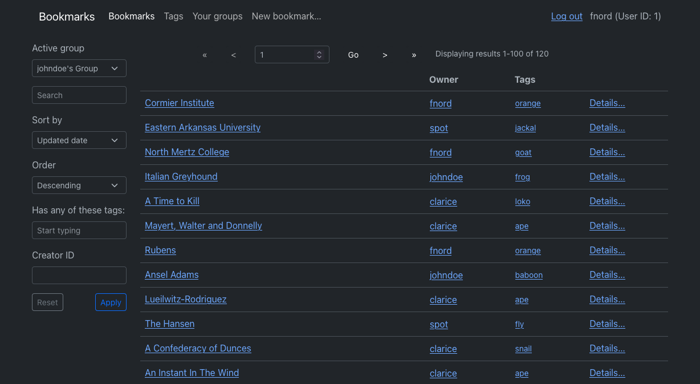

# React SPA frontend for [Bookmarks API](https://github.com/vvergara2/bookmarks_spring_api)
Demo populated with fake data available [here](https://bookmarksapptest.us.to) (as of July 16, 2023). Data resets every 24 hours.

## Features
- Bookmarks list view with pagination and dialog for filtering and sorting.
- Tags list view with links to directly jump to tagged bookmarks.
- Group list view to manage logged-in user's groups, group invites, and allow for creating new groups.
- Group user management view to manage group membership and individual user privileges.
- Detail view for individual bookmarks and tags.
- Forms for user registration, log in, account verification, and password reset.
- Forms for updating and creating bookmarks and tags.